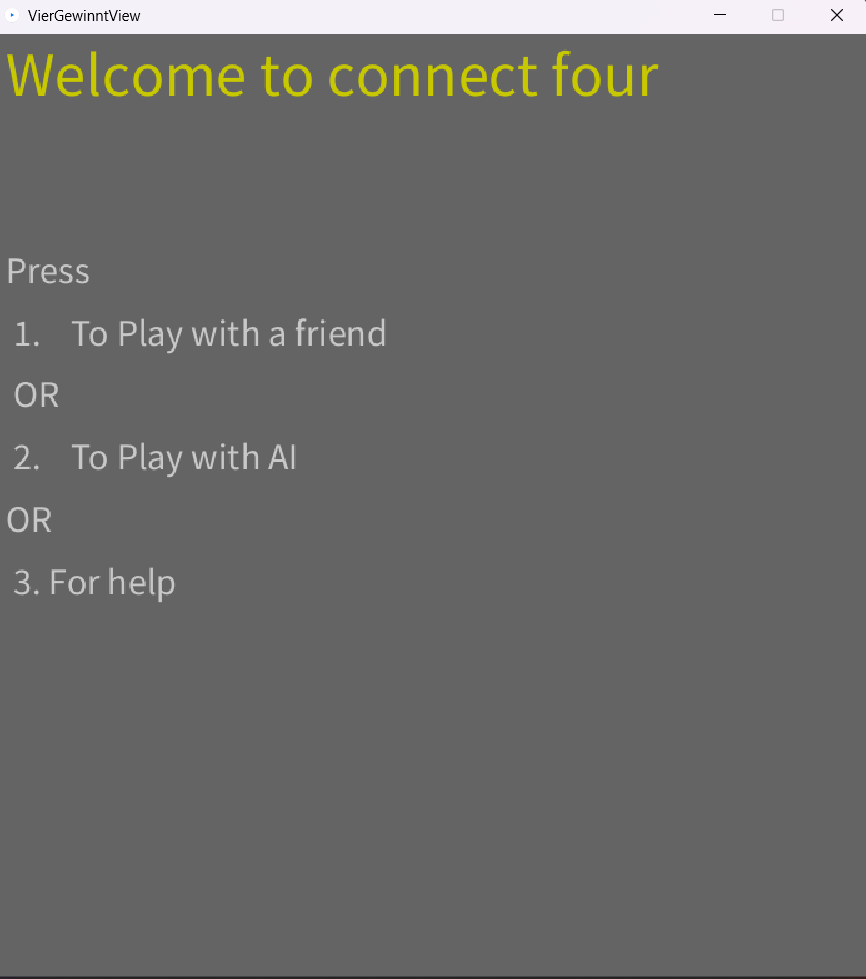

# README

## Inhaltsverzeichnis:

- *Präsentation und Beschreibung des Spiel VierGewinnt.*
- *Starten des Spiels in IntelliJ.*
- *Implementierung eines Threads.*
- *Starten des Spiels in Jshell.*
- *JUnit-Tests.*
- *Verwendete Bibliotheken.*

## Darstellung des Spiels

Das Spiel wird auf einem senkrecht stehenden hohlen Spielbrett gespielt, in das die Spieler abwechselnd ihre Spielsteine fallen lassen. Das Spielbrett besteht aus sieben Spalten (senkrecht) und sechs Reihen (waagerecht). Jeder Spieler besitzt 21 gleichfarbige Spielsteine. Wenn ein Spieler einen Spielstein in eine Spalte fallen lässt, besetzt dieser den untersten freien Platz der Spalte. Gewinner ist, wer vier oder mehr seiner Spielsteine in eine waagerechte, senkrecht oder diagonale Linie bringt. Das Spiel endet unentschieden, wenn das Spielbrett komplett gefüllt ist, ohne dass ein Spieler eine Viererlinie gebildet hat.

## Starten des Spiels in IntelliJ

Um das Spiel zu starten muss man die main-Methode in View ausführen und nachdem es gemacht wurde, kommt auf dem Bildschirm ein Bild mit einer Nachricht :  Welcome to connect four; und  mit einigen Hinweise.
Diese Hinweise dienen dazu, dass man sich entscheiden kann:  
- *ob man mit jemandem spielen will und wenn es der Fall ist, drückt man auf "1";* 
 - *ob man mit dem Rechner spielen will, und wenn es der Fall ist, drückt man auf "2"*
 -  *ob man Hilfe braucht, und wenn es der Fall ist, drückt man auf "3"*
### Screenshot

Wenn man auf "3" gedrückt hat, kommt auf den Bildschirm einen Recheck 

