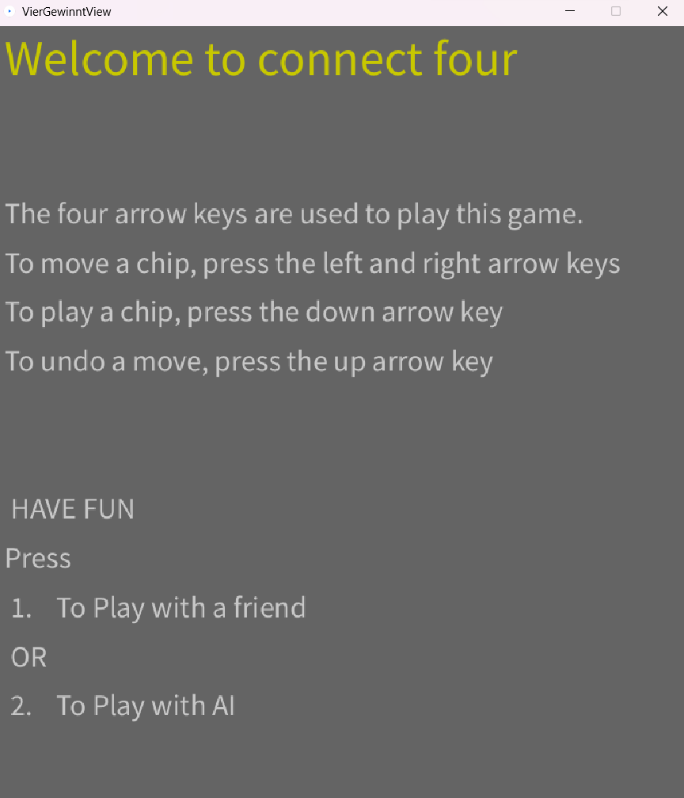
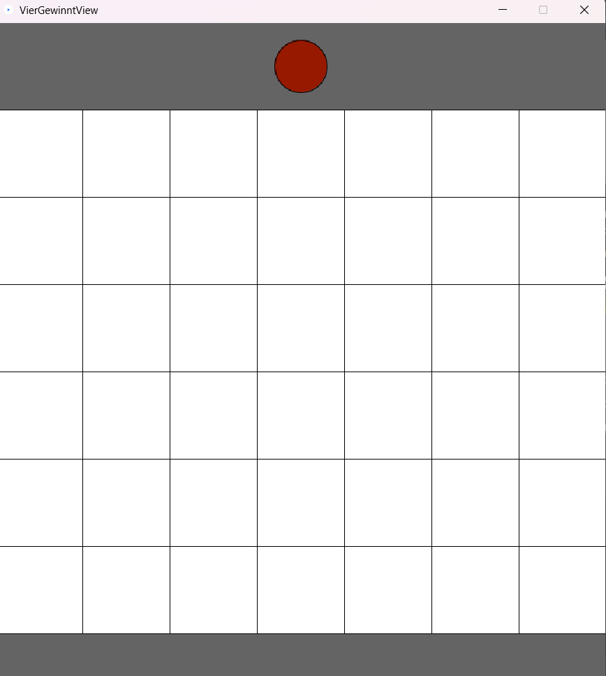
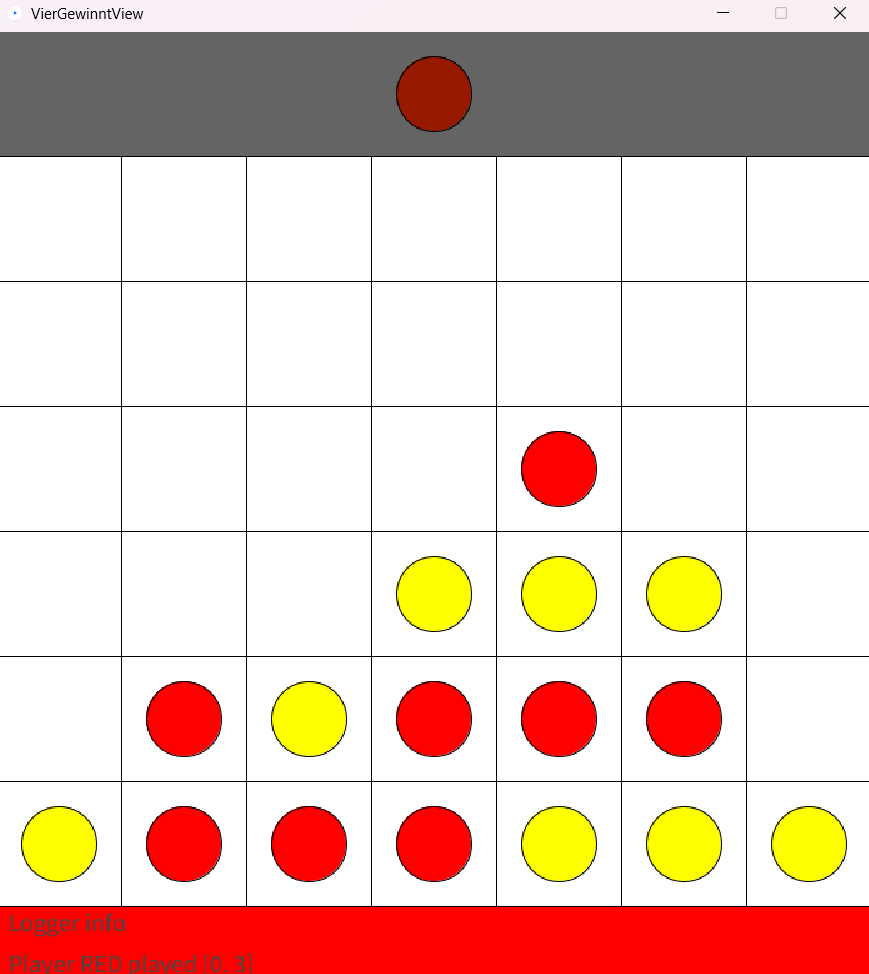
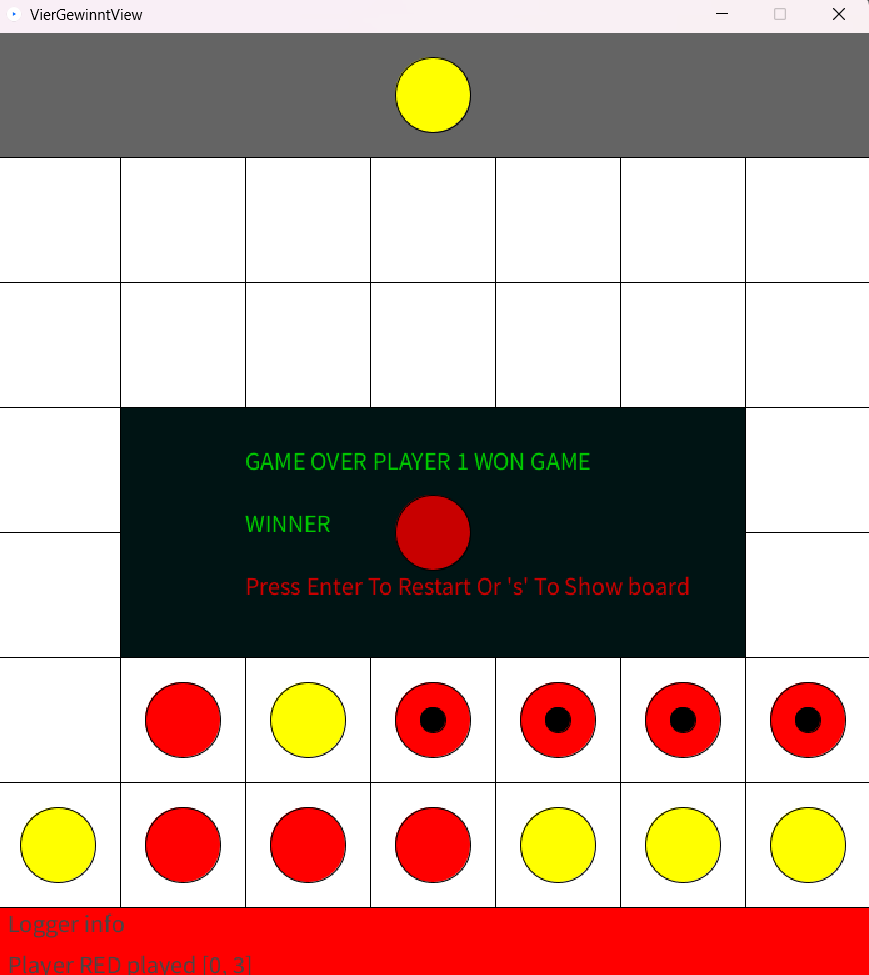
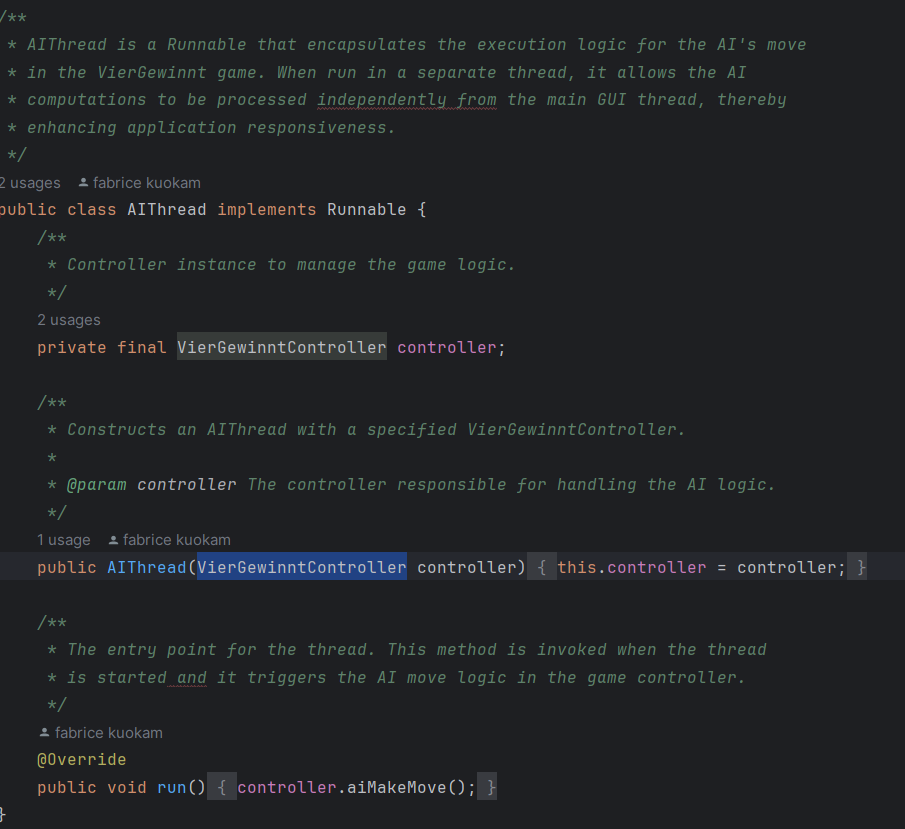
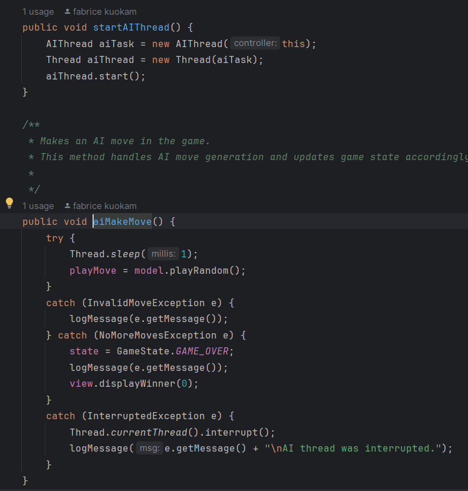
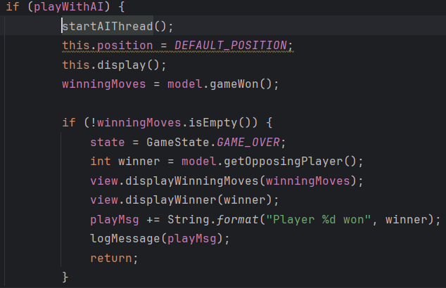
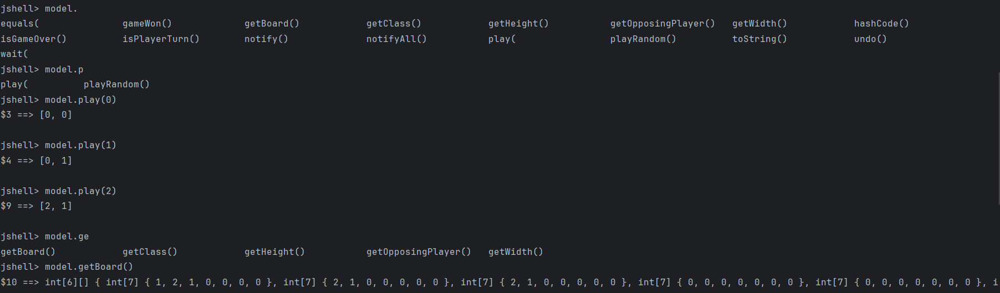
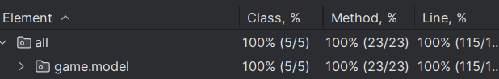
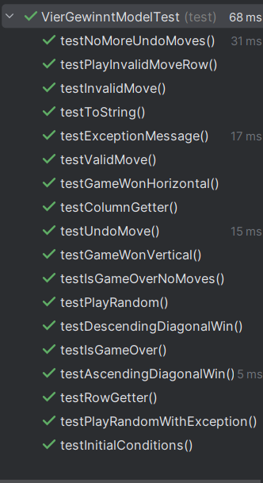

# README

## Inhaltsverzeichnis:

- *Präsentation und Beschreibung des Spiel VierGewinnt.*
- *Starten des Spiels in IntelliJ.*
- *Implementierung eines Threads.*
- *Starten des Spiels in Jshell.*
- *JUnit-Tests.*
- *Verwendete Bibliotheken.*

## Darstellung des Spiels

Das Spiel wird auf einem senkrecht stehenden hohlen Spielbrett gespielt, in das die Spieler abwechselnd ihre Spielsteine fallen lassen. Das Spielbrett besteht aus sieben Spalten (senkrecht) und sechs Reihen (waagerecht). Jeder Spieler besitzt 21 gleichfarbige Spielsteine. Wenn ein Spieler einen Spielstein in eine Spalte fallen lässt, besetzt dieser den untersten freien Platz der Spalte. Gewinner ist, wer vier oder mehr seiner Spielsteine in eine waagerechte, senkrecht oder diagonale Linie bringt. Das Spiel endet unentschieden, wenn das Spielbrett komplett gefüllt ist, ohne dass ein Spieler eine Viererlinie gebildet hat.

## Starten des Spiels in IntelliJ

Um das Spiel zu starten muss man die main-Methode in View ausführen und nachdem es gemacht wurde, kommt auf dem Bildschirm ein Bild mit einer Nachricht :  Welcome to connect four; und  mit einigen Hinweise.
Diese Hinweise dienen dazu, dass man sich entscheiden kann:  
- *ob man mit jemandem spielen will und wenn es der Fall ist, drückt man auf "1";* 
 - *ob man mit dem Rechner spielen will, und wenn es der Fall ist, drückt man auf "2"*
 -  *ob man Hilfe braucht, und wenn es der Fall ist, drückt man auf "3"*
### Screenshot

Wenn man auf "3" gedrückt hat, kommt auf den Bildschirm einen Recheck mit Hinweise wie man das Spiel spielen soll.
und dazu auch die möglichkeit auf "1" oder "2" zu drücken.

 

wenn man auf "1" oder "2" drückt, kann mann dann starten zu spielen.
so soll das Spiel nach diesem schritt aussehen:

Aussehen des Spiel nachdem man gestartet zu spielen hat:

Nachdem das Spiel gewonnen wurde, hat man die möglichkeit auf "S" (zum Sehen des Stands des Spiels)
oder auf "Enter" (zum neu Starten des spiels) zu drücken.

Aussehen des Spiel nachdem man gewonnen hat:

Aussehen des Spiel nachdem man auf "S" gedrückt hat:

## Implementierung eines Threads

Thread wurde implementiert um die AI (spiel mit Rechner) einzusetzen, darüber hinaus
kümmert es sich um die Bewegungen von AI. Dafür wurde eine Klasse "AIThread" in controller erstellt, die die schnittstelle Runnable implementiert.

## Starten des Spiels in Jshell.

Das Modell ist unabhängig von View und Controller und kann daher in der jshell ausgeführt werden. Um dies zu können
Dazu muss man das Terminal öffnen und das Verzeichnis angeben, in dem die Datei des Spiels gespeichert ist. Das obige
kann mit der folgenden Code-Zeile erledigt werden;

- *jshell --class-path ./out/production/VierGewinnt*
 - *import game.model.VierGewinntModel*
- *var model = new VierGewinntModel()*

  Über die jshell können alle Methoden, die nicht als
  privat deklariert sind, aufgerufen werden. Das heißt, das Spiel kann in der jshell unabhängig von einer grafischen Benutzeroberfläche gespielt werden.

## JUnit-Tests.

Die Bibliothek Junit5.8.1 wurde verwendet, um die öffentlichen Methoden des Modells zu testen.
alle Methoden des models wurden erfolgreich getestet.

## Verwendete Bibliotheken.

Für die Realisierung dieses Projekts wurden die folgenden Bibliotheken verwendet:

- *Java SE Development Kit 21.0.1 in intelliJ IDEA*
- *core.jar der Processing 4 Bibliothek von Processing java für die grafische Darstellung des Spiels*
- *controlP5.jar*
- *JUnit5.8.1 für die Tests*
- *cloc-1.98.exe wurde verwendet, um die Codezeilen zu zählen*

